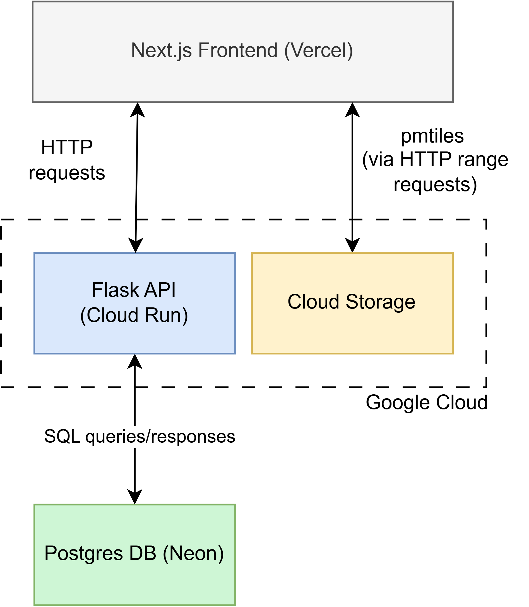

# NZ Census Map Backend


Backend code for [NZ Census Map](https://github.com/HugoPhibbs/nz-census-map). Written with Python using Flask & Psycopg. The Postgres database is deployed onto [Neon](https://neon.com/), while Google's [Cloud Run](https://cloud.google.com/run) and [Cloud Storage](https://docs.cloud.google.com/storage/docs) are used to for the API and object storage respectively.

## Instructions

* To install dependencies:
```shell
pip install -r requirements.txt
```
* To run a local production server, use:
```shell
python -m src.app
```

* The Cloud Run deployment is automated with GH actions, however, if you wish to do a fresh deployment, use:
```shell
python deploy.py
```

## System Architecture




