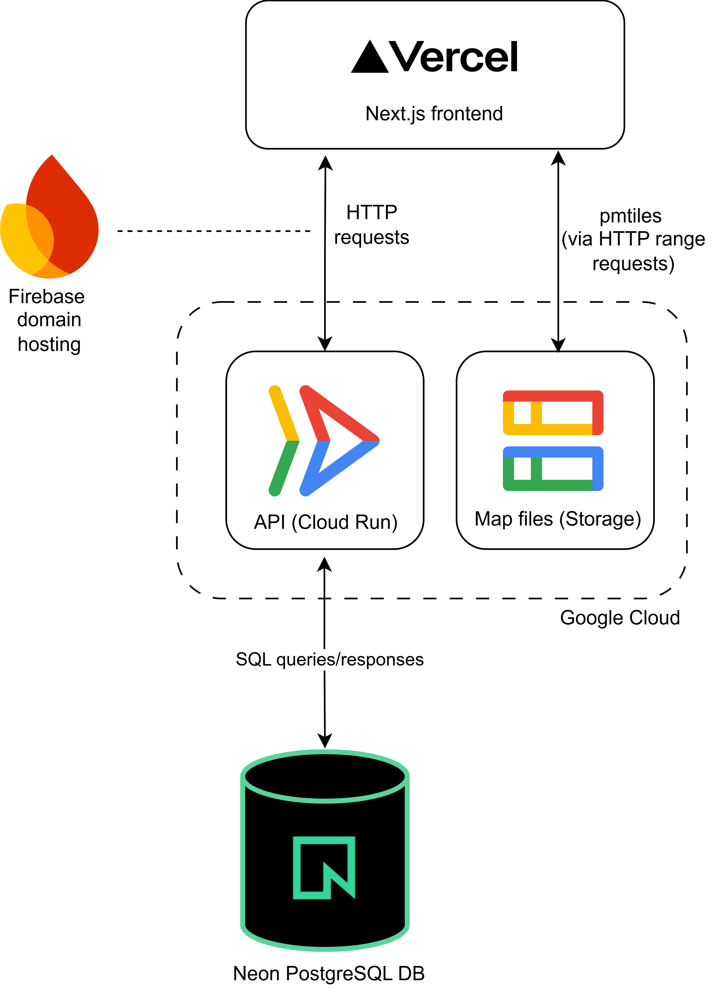

# NZ Census Map Backend


_Main repository: [nz-census-map](https://github.com/HugoPhibbs/nz-census-map)_

Backend code for [NZ Census Map](https://github.com/HugoPhibbs/nz-census-map).

## Instructions

* You will need [uv](https://docs.astral.sh/uv/getting-started/installation/) and Python 3.12 installed.

* To install dependencies:
```shell
uv sync
```
* To run a local production server, use:
```shell
python -m src.app
```

* The Cloud Run deployment is automated with GH actions, however, if you wish to do a fresh deployment (this will require the [gcloud](https://cloud.google.com/cli) & [Firebase](https://firebase.google.com/docs/cli) CLIs installed, configured, and globally available), use
```shell
python deploy.py
```

## Using the API

* The URL of the API is _non-stable_, it changes depending on deployments. 
* The OpenAPI specification can be found in [openapi.yaml](./docs/openapi.yaml).

## System Architecture

* The overall architecture is largely a 3 tier architecture. 
* The frontend is written with Next.js and TypeScript, and the backend is written with Python using Flask & Psycopg. 
* The PostgreSQL database is deployed onto [Neon](https://neon.com/), while Google's [Cloud Run](https://cloud.google.com/run) is used to deploy the HTTP API.
* Map files (as [pmtiles](https://docs.protomaps.com/pmtiles/)) are stored on [Cloud Storage](https://docs.cloud.google.com/storage/docs), and are fetched directly from the frontend using a presigned URL.
* Firebase [Hosting](https://firebase.google.com/docs/hosting) is used to map the subdomain `api.nz-census-map.com` to the API within Cloud Run


